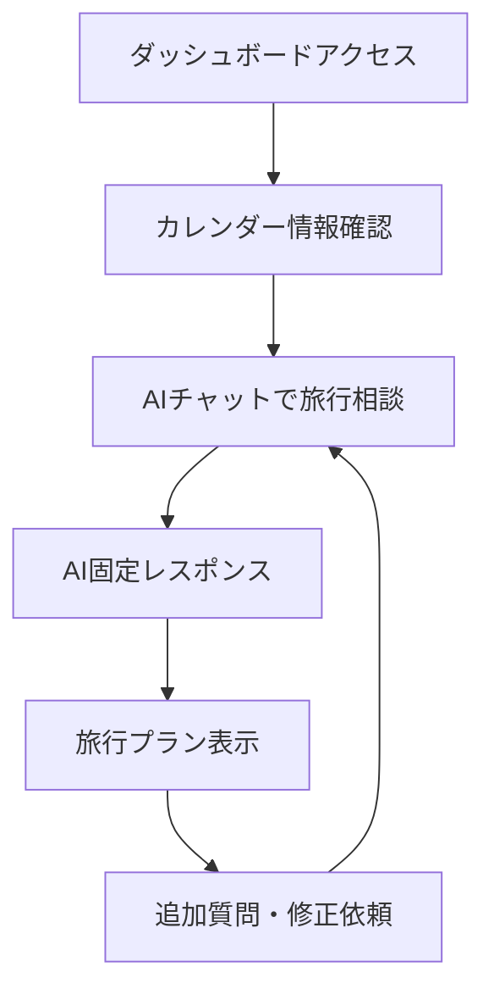

## 1. Product Overview
カップル向けに最適な旅行日程を提案するAIエージェントWebアプリケーション。カレンダーの空き日程を自動分析し、過去の情報を参考にしたパーソナライズされた旅行プランを提案します。
- ダミーアカウントでログイン済み状態で動作し、実際の認証機能は不要
- 固定のAIレスポンスを使用してプロトタイプとして機能

## 2. Core Features

### 2.1 User Roles
認証機能は実装せず、ダミーアカウントで固定運用するため、ユーザー役割の区別は不要です。

### 2.2 Feature Module
カップル向け旅行プラン作成AIエージェントは以下の主要ページで構成されます：
1. **メインダッシュボード**: 3カラムレイアウト（チャット履歴、旅行プラン提案、カレンダー表示）

### 2.3 Page Details

| Page Name | Module Name | Feature description |
|-----------|-------------|---------------------|
| メインダッシュボード | 左カラム - チャット履歴 | AIエージェントとユーザーの会話履歴を時系列で表示。メッセージの送受信、スクロール機能 |
| メインダッシュボード | 中央カラム - 旅行プラン提案 | AIが生成した旅行プランの詳細表示。日程、場所、アクティビティ、関連カレンダー予定の可視化 |
| メインダッシュボード | 右カラム - カレンダー表示 | 各ユーザー（カップル）のカレンダー情報をダミーデータで表示。空き日程のハイライト表示 |
| メインダッシュボード | AIエージェント機能 | ユーザーからの質問に対して固定レスポンスを返す。カレンダー分析結果の表示 |
| メインダッシュボード | データ管理 | ダミーカレンダーデータの管理と表示。過去の旅行履歴データの参照 |

## 3. Core Process

**メインユーザーフロー:**
1. ユーザーがダッシュボードにアクセス（ダミーアカウントで自動ログイン済み）
2. 右カラムでカップル双方のカレンダー情報を確認
3. 左カラムのチャットでAIエージェントに旅行プランを依頼
4. AIエージェントが固定レスポンスで旅行提案を返答
5. 中央カラムに詳細な旅行プランと関連カレンダー情報が表示
6. ユーザーがプランを確認し、追加の質問や修正依頼をチャットで行う

## 4. User Interface Design

### 4.1 Design Style
- **プライマリカラー**: #FF6B6B（温かみのあるコーラルピンク）
- **セカンダリカラー**: #4ECDC4（爽やかなターコイズ）
- **ボタンスタイル**: 角丸（border-radius: 8px）、ソフトシャドウ付き
- **フォント**: Noto Sans JP、メインテキスト16px、見出し24px
- **レイアウトスタイル**: 3カラムグリッドレイアウト、カード型コンポーネント
- **アイコンスタイル**: 旅行関連の絵文字（✈️🏖️🗓️💕）とFeather Icons

### 4.2 Page Design Overview

| Page Name | Module Name | UI Elements |
|-----------|-------------|-------------|
| メインダッシュボード | 左カラム - チャット履歴 | 白背景のメッセージバブル、ユーザーメッセージは右寄せ（#FF6B6B）、AIメッセージは左寄せ（#F8F9FA）、入力フィールドは下部固定 |
| メインダッシュボード | 中央カラム - 旅行プラン提案 | カード型レイアウト、グラデーション背景（#FF6B6B to #4ECDC4）、日程タイムライン表示、アイコン付きアクティビティリスト |
| メインダッシュボード | 右カラム - カレンダー表示 | 月表示カレンダー、空き日程は#4ECDC4でハイライト、予定ありは#FFE66D、ユーザー別タブ切り替え |

### 4.3 Responsiveness
デスクトップファーストで設計し、タブレット・モバイルでは3カラムを縦積みレイアウトに変更。タッチ操作に最適化されたボタンサイズ（最小44px）を採用。