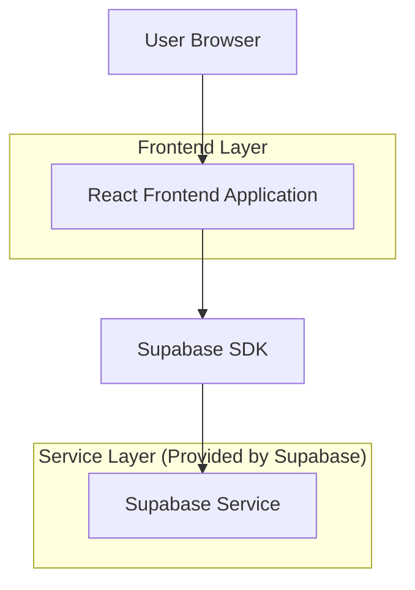
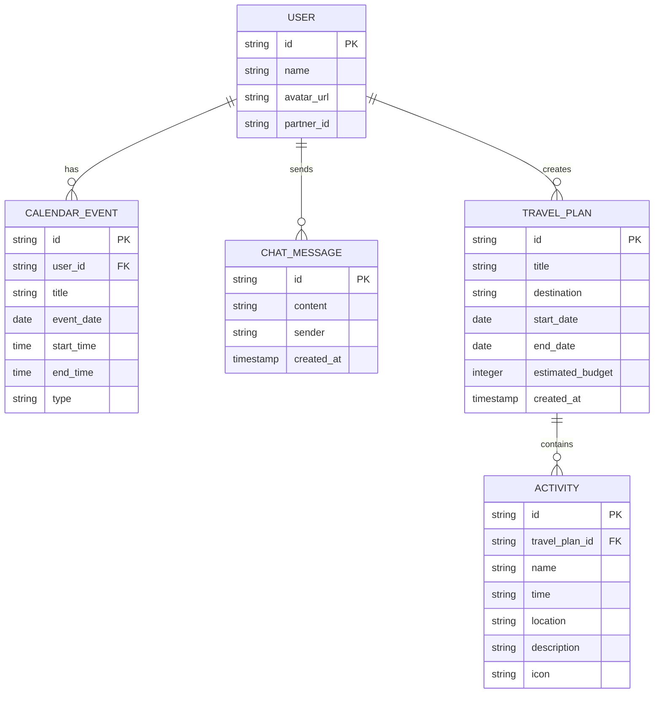

## 1.Architecture design



## 2.Technology Description

- Frontend: React@18 + TypeScript@5 + Tailwind CSS@3 + Vite@5
- Backend: Supabase (Authentication, Database, Storage)
- State Management: React Context API + useReducer
- UI Components: Headless UI + Heroicons
- Date Handling: date-fns

## 3.Route definitions

| Route | Purpose |
|-------|----------|
| / | メインダッシュボード、3カラムレイアウトで旅行プラン作成機能を提供 |

## 4.API definitions

### 4.1 Core API

**ダミーデータ取得**
```typescript
// ダミーカレンダーデータの型定義
interface CalendarEvent {
  id: string;
  title: string;
  date: string;
  startTime: string;
  endTime: string;
  userId: 'user1' | 'user2';
  type: 'work' | 'personal' | 'free';
}

// チャットメッセージの型定義
interface ChatMessage {
  id: string;
  content: string;
  sender: 'user' | 'ai';
  timestamp: string;
}

// 旅行プランの型定義
interface TravelPlan {
  id: string;
  title: string;
  destination: string;
  startDate: string;
  endDate: string;
  activities: Activity[];
  estimatedBudget: number;
}

interface Activity {
  id: string;
  name: string;
  time: string;
  location: string;
  description: string;
  icon: string;
}
```

**固定AIレスポンス**
```typescript
// AIエージェントの固定レスポンス関数
function getAIResponse(userMessage: string): ChatMessage {
  const responses = [
    "お二人のカレンダーを確認しました！来月の3連休がおすすめです。温泉旅行はいかがでしょうか？",
    "素敵ですね！箱根の温泉旅館を予約して、美術館巡りも楽しめるプランを作成しました。",
    "予算に合わせて、日帰り温泉と地元グルメを楽しむプランもご提案できます。"
  ];
  
  return {
    id: generateId(),
    content: responses[Math.floor(Math.random() * responses.length)],
    sender: 'ai',
    timestamp: new Date().toISOString()
  };
}
```

## 5.Data model

### 5.1 Data model definition



### 5.2 Data Definition Language

**ユーザーテーブル (users)**
```sql
-- create table
CREATE TABLE users (
    id UUID PRIMARY KEY DEFAULT gen_random_uuid(),
    name VARCHAR(100) NOT NULL,
    avatar_url TEXT,
    partner_id UUID REFERENCES users(id),
    created_at TIMESTAMP WITH TIME ZONE DEFAULT NOW()
);

-- grant permissions
GRANT SELECT ON users TO anon;
GRANT ALL PRIVILEGES ON users TO authenticated;

-- init data
INSERT INTO users (id, name, avatar_url) VALUES 
('user1-uuid', '田中 太郎', 'https://example.com/avatar1.jpg'),
('user2-uuid', '田中 花子', 'https://example.com/avatar2.jpg');

UPDATE users SET partner_id = 'user2-uuid' WHERE id = 'user1-uuid';
UPDATE users SET partner_id = 'user1-uuid' WHERE id = 'user2-uuid';
```

**カレンダーイベントテーブル (calendar_events)**
```sql
-- create table
CREATE TABLE calendar_events (
    id UUID PRIMARY KEY DEFAULT gen_random_uuid(),
    user_id UUID REFERENCES users(id) NOT NULL,
    title VARCHAR(200) NOT NULL,
    event_date DATE NOT NULL,
    start_time TIME,
    end_time TIME,
    type VARCHAR(20) DEFAULT 'personal' CHECK (type IN ('work', 'personal', 'free')),
    created_at TIMESTAMP WITH TIME ZONE DEFAULT NOW()
);

-- create index
CREATE INDEX idx_calendar_events_user_date ON calendar_events(user_id, event_date);
CREATE INDEX idx_calendar_events_date ON calendar_events(event_date DESC);

-- grant permissions
GRANT SELECT ON calendar_events TO anon;
GRANT ALL PRIVILEGES ON calendar_events TO authenticated;

-- init data
INSERT INTO calendar_events (user_id, title, event_date, start_time, end_time, type) VALUES 
('user1-uuid', '会議', '2024-02-15', '10:00', '12:00', 'work'),
('user1-uuid', 'ランチ', '2024-02-15', '12:30', '13:30', 'personal'),
('user2-uuid', 'ヨガクラス', '2024-02-15', '19:00', '20:00', 'personal'),
('user2-uuid', 'プロジェクト会議', '2024-02-16', '14:00', '16:00', 'work');
```

**チャットメッセージテーブル (chat_messages)**
```sql
-- create table
CREATE TABLE chat_messages (
    id UUID PRIMARY KEY DEFAULT gen_random_uuid(),
    content TEXT NOT NULL,
    sender VARCHAR(10) NOT NULL CHECK (sender IN ('user', 'ai')),
    created_at TIMESTAMP WITH TIME ZONE DEFAULT NOW()
);

-- create index
CREATE INDEX idx_chat_messages_created_at ON chat_messages(created_at DESC);

-- grant permissions
GRANT SELECT ON chat_messages TO anon;
GRANT ALL PRIVILEGES ON chat_messages TO authenticated;
```

**旅行プランテーブル (travel_plans)**
```sql
-- create table
CREATE TABLE travel_plans (
    id UUID PRIMARY KEY DEFAULT gen_random_uuid(),
    title VARCHAR(200) NOT NULL,
    destination VARCHAR(100) NOT NULL,
    start_date DATE NOT NULL,
    end_date DATE NOT NULL,
    estimated_budget INTEGER,
    created_at TIMESTAMP WITH TIME ZONE DEFAULT NOW()
);

-- grant permissions
GRANT SELECT ON travel_plans TO anon;
GRANT ALL PRIVILEGES ON travel_plans TO authenticated;
```

**アクティビティテーブル (activities)**
```sql
-- create table
CREATE TABLE activities (
    id UUID PRIMARY KEY DEFAULT gen_random_uuid(),
    travel_plan_id UUID REFERENCES travel_plans(id) NOT NULL,
    name VARCHAR(200) NOT NULL,
    time VARCHAR(50),
    location VARCHAR(200),
    description TEXT,
    icon VARCHAR(50),
    created_at TIMESTAMP WITH TIME ZONE DEFAULT NOW()
);

-- create index
CREATE INDEX idx_activities_travel_plan ON activities(travel_plan_id);

-- grant permissions
GRANT SELECT ON activities TO anon;
GRANT ALL PRIVILEGES ON activities TO authenticated;
```